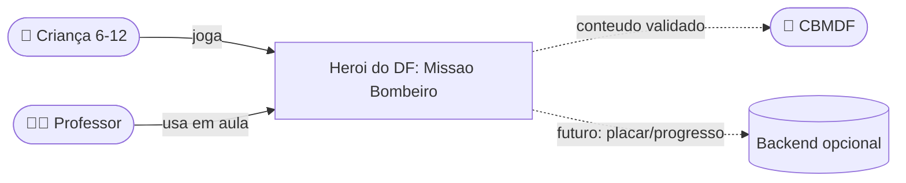
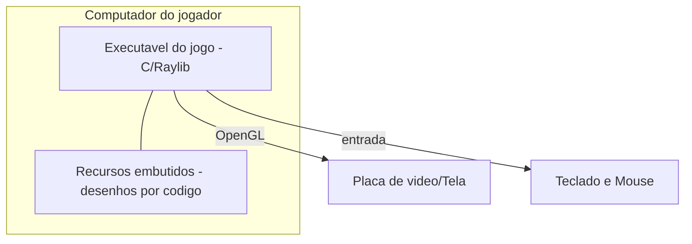
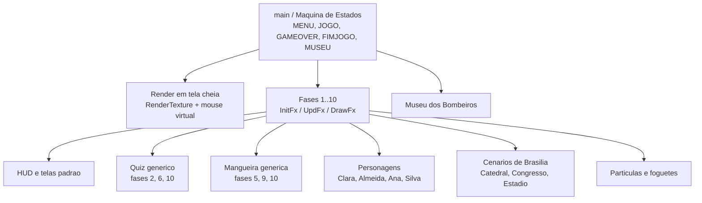

# 🏗️ Arquitetura do Projeto

Arquitetura documentada em Markdown usando o **C4 Model** (4 níveis de zoom).
Os diagramas usam **Mermaid**, que o GitHub renderiza automaticamente.

## 🧭 Framework norteador: C4 Model + arc42

- **C4 Model** (Simon Brown) — descreve o sistema em 4 níveis: **Contexto →
  Contêineres → Componentes → Código**. Simples e visual.
- **arc42** — estrutura de referência para documentação de arquitetura
  (decisões, restrições, qualidade).

---

## Nível 1 — Contexto

O jogo é **desktop, single-player e offline**. Um backend é apenas uma
possibilidade futura (placar, progresso, painel do professor).

## Nível 2 — Contêineres

Hoje há **um único contêiner**: o executável. Todo o conteúdo visual é desenhado
por código (pixel-art com retângulos), sem arquivos externos.

## Nível 3 — Componentes (módulos do código)

## Nível 4 — Código (padrão de cada fase)

Quase toda fase segue **três funções**:

| Função | Responsabilidade |
|---|---|
| `InitFx()` | inicializa estado, posições e contadores |
| `UpdFx(...)` | lógica por quadro (entrada, colisões, regras, vitória) |
| `DrawFx(...)` | desenha a fase na tela |

O `main()` roda o laço: lê entrada → atualiza a fase atual → desenha em uma
**textura virtual 600×800** que é escalada para a tela cheia (com o mouse
convertido para as coordenadas virtuais).

---

## Decisões de arquitetura (ADR resumido)

| Decisão | Motivo |
|---|---|
| **C + Raylib** | leve, multiplataforma, ótimo para 2D e ensino |
| **Arquivo único** | simples de compilar e distribuir no contexto acadêmico |
| **Arte por código** | sem dependência de assets externos |
| **Máquina de estados** | clareza no fluxo entre menu, fases e museu |
| **RenderTexture** | tela cheia nítida mantendo a proporção 600×800 |

## Atributos de qualidade
- **Desempenho:** 60 FPS em hardware simples.
- **Portabilidade:** Windows, Linux e macOS (mesmo código).
- **Manutenibilidade:** funções compartilhadas (quiz, mangueira, HUD) evitam repetição.
- **Evolutividade:** novas fases entram só adicionando `case` na máquina de estados.
