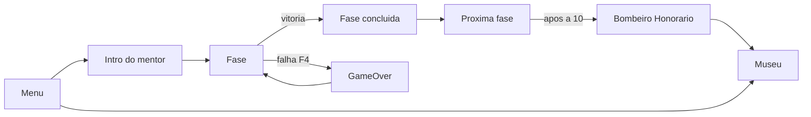

# 🎨 UX/UI e Design System

Plano de experiência (UX) e interface (UI), com **Design System**, princípios de
**Material Design** e **Atomic Design**.

## 🧭 Framework norteador: Material Design 3 + Atomic Design + Heurísticas de Nielsen

- **Material Design 3** (Google) — base de **tokens** (cor, tipografia,
  espaçamento, forma) e padrões de componentes acessíveis.
- **Atomic Design** (Brad Frost) — organiza a UI em **átomos → moléculas →
  organismos → templates → telas**.
- **10 Heurísticas de Nielsen** — checklist de usabilidade.

---

## 🎯 Princípios de UX para o público (6–12 anos)
- **Textos curtos** e linguagem simples; apoiar com **ícones e cores**.
- **Feedback imediato** (acerto/erro, conclusão de fase, celebração).
- **Reforço positivo**, sem punição pesada (jogo gentil).
- **Sessões curtas** e objetivos claros por fase.
- **Acessibilidade:** alto contraste, fonte legível, alvos de clique grandes.

---

## 🧱 Design System (tokens)

### Cores (paleta atual do jogo)
| Token | Uso | Referência |
|---|---|---|
| `vermelho-bombeiro` | identidade, viatura, títulos | `#C8281E` aprox. |
| `amarelo-alerta` | destaques, faixas, estrelas | `#FFC800` aprox. |
| `azul-cadete` | uniforme da Clara, botões | `#3C6ED2` aprox. |
| `verde-sucesso` | acertos, conclusão | `#1E9628` aprox. |
| `fundo-escuro` | planos de fundo | `#0F1228` aprox. |
| `texto-claro` | textos sobre fundo escuro | `#FFFFFF` |

> Padronizar esses valores e documentar contraste (WCAG AA) é parte da entrega.

### Tipografia
- Fonte padrão da Raylib (bitmap). Tamanhos em escala: **título 26–40**,
  **subtítulo 18–22**, **corpo 16–19**, **legenda 13–15**.
- Recomendações: aumentar corpo e usar **sombra de contraste** (já aplicado) para
  legibilidade infantil.

### Espaçamento e forma
- Grade base **600×800** (retrato). Margens e botões com cantos arredondados.
- Alvos de toque/clique amplos (mín. ~44 px).

---

## ⚛️ Atomic Design (mapeado no jogo)
- **Átomos:** botões, ícones (mangueira, extintor…), estrelas, textos.
- **Moléculas:** cartão de pergunta do quiz, botão de equipamento, medalha.
- **Organismos:** HUD (fase/estrelas/vidas), telas de fase concluída, museu.
- **Templates/Telas:** Menu, Fase, Game Over, Fim de Jogo, Museu.

---

## 🗺️ Fluxo de navegação

---

## ✅ Checklist (Heurísticas de Nielsen)
- [ ] Visibilidade do estado (HUD mostra fase, estrelas, vidas)
- [ ] Linguagem do usuário (palavras simples, sem jargão)
- [ ] Controle e liberdade (voltar ao menu, tentar de novo)
- [ ] Consistência (mesmos botões/cores em todas as telas)
- [ ] Prevenção de erros (jogo gentil, sem punição dura)
- [ ] Reconhecer em vez de lembrar (ícones + texto)
- [ ] Estética minimalista (foco no objetivo da fase)
- [ ] Feedback de erro claro e amigável
- [ ] Ajuda/instrução (mentor explica cada fase)

## 📦 Sugestão de entregáveis
- `design-system.md` (tokens detalhados)
- `wireframes/` (telas)
- `fluxo-navegacao.md`
- Protótipo no **Figma** (link)
