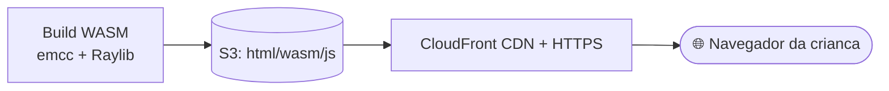
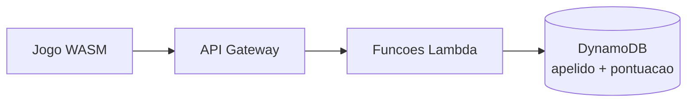

# ☁️ Plano de Instanciamento em Cloud

Como **hospedar/distribuir** o jogo na nuvem. A Raylib compila para
**WebAssembly** (via Emscripten), então existe um caminho natural para uma
**versão web** rodando no navegador — além de um backend opcional.

## 🧭 Framework norteador: AWS Well-Architected + 12-Factor App

- **AWS Well-Architected Framework** — 6 pilares: **excelência operacional,
  segurança, confiabilidade, eficiência de desempenho, otimização de custos e
  sustentabilidade**. (Vale também para GCP/Azure de forma equivalente.)
- **12-Factor App** — boas práticas para apps em nuvem (config no ambiente,
  build/release/run separados, logs como fluxo, etc.).

---

## 🎯 Cenários de implantação

### Cenário A — Site estático (recomendado para começar) 💡
Build **WebAssembly** (`emcc` + Raylib) gera `index.html` + `.wasm` + `.js`.
Hospedar como **site estático**:
- **AWS:** S3 (arquivos) + CloudFront (CDN/HTTPS).
- Alternativas simples: **GitHub Pages**, **Netlify**, **itch.io**.
- **Custo:** baixíssimo (faixa gratuita); escala bem com CDN.

### Cenário B — Distribuição de binários
Hospedar os instaladores (Windows/Linux/macOS) em **S3 + CloudFront** ou em
**Releases do GitHub**, com **hash SHA-256** para verificação.

### Cenário C — Backend opcional (placar/progresso)
Arquitetura **serverless** (barata e escalável):

> Guardar **apenas apelido anônimo e pontuação** — nada de dado pessoal de menor.

---

## 🧰 Boas práticas (Well-Architected aplicado)
| Pilar | Como aplicar aqui |
|---|---|
| Operação | CI/CD (GitHub Actions) para build e deploy automáticos |
| Segurança | HTTPS, IAM com menor privilégio, segredos em cofre |
| Confiabilidade | CDN + backups; infraestrutura como código (**Terraform**) |
| Desempenho | CDN próxima do usuário; assets comprimidos |
| Custo | Faixa gratuita, serverless sob demanda |
| Sustentabilidade | Servir estático (baixo consumo) sempre que possível |

## 🔧 Infra como código (sugestão)
- **Terraform** para descrever S3, CloudFront, Lambda, DynamoDB.
- **GitHub Actions:** pipeline `build (emcc) → deploy (S3) → invalidar CDN`.

## ✅ Checklist
- [ ] Escolher cenário (A recomendado para o MVP)
- [ ] Build WebAssembly testado
- [ ] Hospedagem com **HTTPS**
- [ ] Pipeline de deploy (CI/CD)
- [ ] Estimativa de custo (faixa gratuita)
- [ ] (Se backend) apenas dados anônimos
